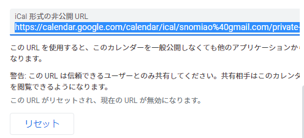

# schtasks-calendar (or schcal)

Google calendar events that contains a markdown link will be sync to windows schedule tasks then the link will open automatically on time on your PC.

## Get Started

### 1. First you may need to add some events in the next few days.

Fill in summary in the following format:
- `[ ...taskname ]( ...link )`
- `[ ...taskname ]( ...local_application_path )`

Example:
- `[ view schtasks-calendar ]( https://github.com/snomiao/schtasks-calendar )`

  

### 2. Then goto the calendar settings.

Scroll down and copy the private ics url
  


And you'll get the ics url https://calendar.google.com/calendar/ical/xxxxxxxxxxxxxxxxxxx/private-cxxxxxxxxxxxxxxxxxxxxxxxxxxxxxxx/basic.ics


### 3. Then run as the command params.

```sh
npx schcal YOUR_ICS_URL
```

Example:
```sh
npx schcal https://calendar.google.com/calendar/ical/xxxxxxxxxxxxxxxxxxx/private-cxxxxxxxxxxxxxxxxxxxxxxxxxxxxxxx/basic.ics
```

You will see this


### 4. Check your schtasks

Press `Win + R` and run `taskschd.msc` to open Windows Tasks Scheduler


The task `SSAC-0820-0530-view schtasks-calendar-XXXXXX` is the event you just added to calendar and the link will be open on time.

### 5. Config schtasks auto update (daily or whatever)

If you want to keep using this and you can config the auto update (daily or whatever).

`config.yaml`
```yaml
ICS_URLS:
  - https://calendar.google.com/calendar/ical/xxxxxxxxxxxxxxxxxxx/private-cxxxxxxxxxxxxxxxxxxxxxxxxxxxxxxx/basic.ics
```

Then run `add-to-schtasks.bat` which will update your 17:00 every day (you can change this by edit the bat file)

Then run `schtasks /Run /tn SSAC` to test this schtasks.

## Other Methods

### Run by command.

```sh
npx schcal https://calendar.google.com/calendar/ical/xxxxxxxxxxxxxxxxxxx/private-cxxxxxxxxxxxxxxxxxxxxxxxxxxxxxxx/basic.ics
```

Or

```sh
npm i schtasks-calendar -g
schcal https://calendar.google.com/calendar/ical/xxxxxxxxxxxxxxxxxxx/private-cxxxxxxxxxxxxxxxxxxxxxxxxxxxxxxx/basic.ics
```

### Run by `config.yaml`

Make a `config.yaml` like this

```yaml
# your ics urls, the order is not important
ICS_URLS:
  # snomiao's private calendar ( demo )
  - https://calendar.google.com/calendar/ical/snomiao%40gmail.com/private-d772b2790a1a73de26afb64188c5ca0a/basic.ics
  # a calendar
  - https://calendar.google.com/calendar/ical/xxxxxxxxxxxxxxxxxxx/private-cxxxxxxxxxxxxxxxxxxxxxxxxxxxxxxx/basic.ics
  # another calendar
  - https://calendar.google.com/calendar/ical/xxxxxxxxxxxxxxxxxxx/private-cxxxxxxxxxxxxxxxxxxxxxxxxxxxxxxx/basic.ics

# Optional, if you want cache the ... defaults to 0 (don't use cache and never safe a cache file)
CACHE_TIMEOUT: 3600e3

# Optional, if you need a proxy to access google... Or you can delete this line. defaults to empty
HTTP_PROXY: http://localhost:1080

# Optional, how many days events will add to schtasks, defaults to 7 (then you can run me weekly)
FORWARD_DAYS: 7
```

and run

```sh
npx schcal
```
in your `config.yaml` 's working directory.

## Supported formats

You can put below into summary or descriptions of events which you want to launch the link or programs on the time.
1. Web Links: `http://...` , `https://...` , `ftp://...` , `file://...`
1. Markdown Links: `[ ... ]( ... )`
1. Run Command: `RUN ...`

(supports urls and custom protocal and local files)

## TODOS

- [ ] Translate this into chinese version README.md

## More references and secondary development

- [schtasks | Microsoft Docs]( https://docs.microsoft.com/en-us/windows-server/administration/windows-commands/schtasks )
- [手把手教你使用nodejs编写cli(命令行) - 掘金]( https://juejin.im/post/6844903702453551111 )
- [PC Automation - IFTTT]( https://ifttt.com/applets/190903p-pc-automation )